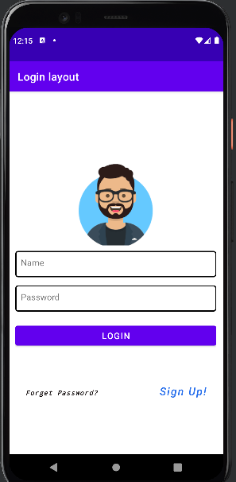
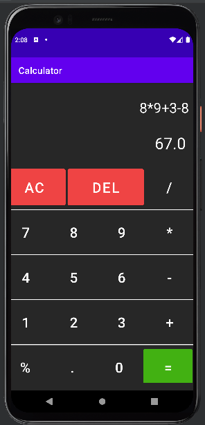

# Android-Apps (Mobile Computing)
These are four simple apps covering concepts of Layouts, Activites and Click Listeners, taught by us in course of **Mobile Computing**.    

## Apps
- Toast Game
- Calculator
- Login Layout
- Activities Collaboration
- News App 
- First App (Hello World)

## Screenshots
Login Layout    |  Calculator
:-------------------------:|:-------------------------:
  |  

Toast Game          |  News App
:-------------------------:|:-------------------------:
  |  

Activities Collab         |  Activities Collab
:-------------------------:|:-------------------------:
  |  

## Installation 🔌
1. Press the **Fork** button (top right the page) to save copies of these projects on your account.

2. Download the repository files (projects) from the download section or clone this project in your PC by using clone command or downloading zip file.

3. Imported any project in Intellij IDEA or any other Android Studio.

4. Run the application :D

## Contributing 💡
If you want to contribute to this project and make it better with new ideas, your pull request is very welcomed.
If you find any issue just put it in the repository issue section, Thank you.

.سبحَانَكَ اللَّهُمَّ وَبِحَمْدِكَ، أَشْهَدُ أَنْ لا إِلهَ إِلأَ انْتَ أَسْتَغْفِرُكَ وَأَتْوبُ إِلَيْكَ
